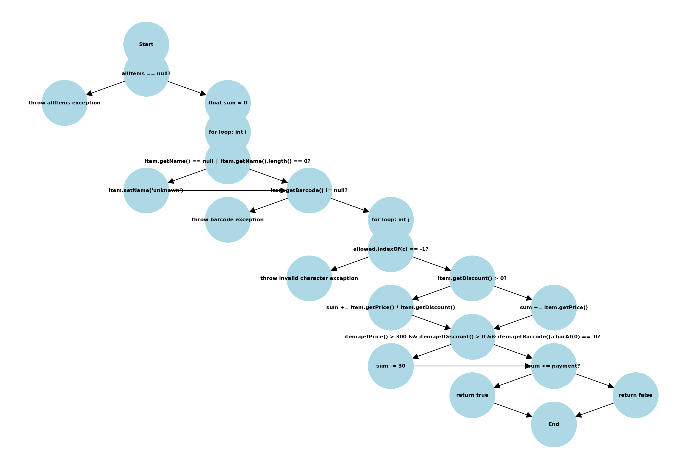

# SI_2024_lab2_225061

## Леонид Ангеловски, број на индекс - 225061

### Control Flow Graph


## Цикломатска комлексност
#### Цикломатската комплексност на дадениот код е 8. Ова значи дека постојат 8 независни патеки низ функцијата checkCart, што е индикатор за бројот на различни логички гранки во кодот.

## Тест случаи според критериумот Every Branch

#### Тест случај за кога листата allItems е null и функцијата фрла Exception:

```java
 @Test
    void test1() {
        Throwable exception = assertThrows(RuntimeException.class, () -> SILab2.checkCart(null, 0));
        assertEquals("allItems list can't be null!", exception.getMessage());
    }
```

#### Во овој случај се проверува дали функцијата правилно фрла RuntimeException кога листата allItems е null.

#### Тест случај за празна листа со доволна уплатена сума:

```java
 @Test
    void test2() {
        List<SILab2.Item> items = new ArrayList<>();
        assertTrue(SILab2.checkCart(items, 100));
    }

```

#### Во овој случај се проверува дали функцијата враќа true за празна листа и доволна уплатена сума.

#### Тест случај за листа со два производи и недоволна уплатена сума:

```java
@Test
    void test3() {
        SILab2.Item tI1 = new SILab2.Item(null, "123", 100, 0);
        SILab2.Item tI2 = new SILab2.Item("ItemName", "321", 50, 0);
        List<Item> items = new ArrayList<>();
        items.add(tI1);
        items.add(tI2);
        assertFalse(SILab2.checkCart(items, 10));
    }
```

#### Во овој случај се проверува дали функцијата враќа false кога вкупната цена на производите е поголема од уплатената сума.

#### Тест случај за производ без баркод за кој функцијата фрла Exception:

```java
  @Test
    void test4() {
        Item tI1 = new Item(null, null, 100, 0);
        Item tI2 = new Item("ItemName", "321", 50, 0);
        List<Item> items = new ArrayList<>();
        items.add(tI1);
        items.add(tI2);

        Throwable exception = assertThrows(RuntimeException.class, () -> SILab2.checkCart(items, 10));
        assertEquals("No barcode!", exception.getMessage());
    }
```

#### Во овој случај се проверува дали функцијата правилно фрла RuntimeException кога баркодот на производот е null.

#### Тест случај за производ со баркод кој има недозволени карактери и за кој функцијата фрла Exception:

```java
 @Test
    void test5() {
        Item tI1 = new Item(null, "123", 100, 0);
        Item tI2 = new Item("ItemName", "1asd", 50, 0);
        List<Item> items = new ArrayList<>();
        items.add(tI1);
        items.add(tI2);

        Throwable exception = assertThrows(RuntimeException.class, () -> SILab2.checkCart(items, 10));
        assertEquals("Invalid character in item barcode!", exception.getMessage());
    }
```

#### Во овој случај се проверува дали функцијата правилно фрла RuntimeException кога баркодот на производот содржи недозволени карактери.

#### Тест случај за производи кои ги задоволуваат условите за специјално намалување од 30:

```java
@Test
    void test6() {
        Item tI1 = new Item(null, "123", 100, 0);
        Item tI2 = new Item("ItemName", "321", 50, 10);
        Item tI3 = new Item("ItemName", "0321", 350, 10);
        List<Item> items = new ArrayList<>();
        items.add(tI1);
        items.add(tI2);
        items.add(tI3);
        assertFalse(SILab2.checkCart(items, 10));
    }
```
#### Во овој случај се проверува дали функцијата правилно ги пресметува вкупната цена и применува специјалното намалување од 30 кога се задоволени сите услови.

### Објаснување за тест случаи според критериумот Multiple Condition

#### Тест случај за условот if (item.getPrice() > 300 && item.getDiscount() > 0 && item.getBarcode().charAt(0) == '0'):

```java
   @Test
    void test7() {
        Item tI1 = new Item(null, "123", 100, 0);
        Item tI2 = new Item("ItemName2", "321", 350, 0);
        Item tI3 = new Item("ItemName3", "321", 350, 10);
        Item tI4 = new Item("ItemName4", "0123", 350, 10);
        List<Item> items = new ArrayList<>();
        items.add(tI1);
        items.add(tI2);
        items.add(tI3);
        items.add(tI4);
        assertTrue(SILab2.checkCart(items, 10000));
    }
```
#### Во овој случај се тестираат различни комбинации на услови:

#### Првиот производ има цена помала од 300.
#### Вториот производ има цена поголема од 300, но без попуст.

#### Третиот производ има цена поголема од 300 и попуст, но баркодот не почнува со 0.

#### Четвртиот производ ги исполнува сите услови за специјалното намалување од 30.